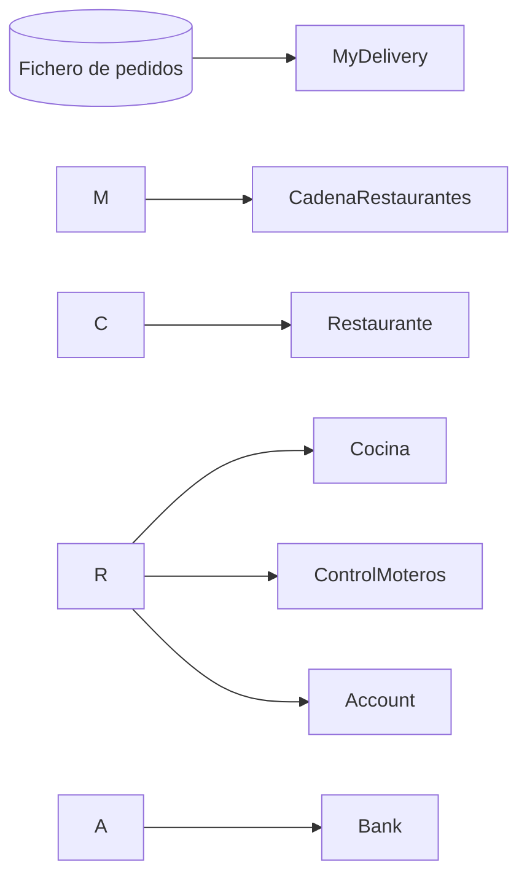

# MyDelivery: Sistema de Delivery Concurrente y Distribuido en Java

Simulación de una cadena de restaurantes con servicio de reparto a domicilio, desarrollada de forma incremental en la asignatura **Programación Concurrente y Distribuida** (Grado en Ingeniería Informática del Software, Universidad de Extremadura).

El proyecto parte de una versión secuencial y evoluciona, versión a versión, aplicando los principales mecanismos de concurrencia y comunicación distribuida de Java: desde monitores y semáforos hasta RxJava, sockets y gRPC.

**Tecnologías:** Java, Concurrencia, Monitores, Semáforos, ExecutorService, Fork/Join, Streams, RxJava, Sockets TCP/UDP, gRPC, Protocol Buffers

\---

## Descripción del sistema

MyDelivery lee pedidos desde un fichero y los reparte entre los restaurantes de la cadena. Cada restaurante cocina el pedido, lo entrega a su servicio de moteros para el reparto y registra el importe en su cuenta bancaria.



### Componentes principales

|Clase|Responsabilidad|
|-|-|
|`MyDelivery`|Programa principal. Lee los pedidos y los envía al restaurante correspondiente|
|`CadenaRestaurantes`|Crea y gestiona todos los restaurantes de la cadena|
|`Restaurante`|Recibe pedidos, los manda a cocina y a reparto, y cobra el importe|
|`Cocina`|Prepara los pedidos de su restaurante|
|`ControlMoteros`|Gestiona el reparto de los pedidos|
|`Pedido` / `Producto`|Modelo de datos, serializable a fichero|
|`Ticket`|Genera identificadores únicos de pedido|
|`Bank` / `Account`|Cuentas bancarias, transferencias y auditorías|
|`Config`|Parámetros de configuración (número de restaurantes, moteros, etc.)|
|`Canal`|Canal de entrada del pedido: Web, Móvil o Call Center|

\---

## Evolución del proyecto

El proyecto se desarrolló de forma incremental: cada versión añade un nuevo concepto sobre la anterior. `mydelivery-core` contiene el resultado final acumulado (v0 a v7) y `mydelivery-grpc` la versión distribuida con gRPC, desarrollada como proyecto Maven independiente.

|Versión|Concepto|Qué se resuelve|
|-|-|-|
|v0|Base secuencial|Flujo completo del sistema sin concurrencia|
|v1|Monitores|Acceso sincronizado a recursos compartidos (`synchronized`, `wait/notify`)|
|v2|Semáforos|Control del número de moteros y pedidos atendidos simultáneamente|
|v3|Executor y Fork/Join|Pools de hilos y división de tareas, como auditorías bancarias en paralelo|
|v4|Streams|Procesamiento declarativo y paralelo de colecciones de pedidos|
|v5|RxJava|Programación reactiva sobre el flujo de pedidos|
|v6|Sockets TCP|Comunicación cliente servidor orientada a conexión|
|v7|Sockets UDP|Comunicación mediante datagramas|
|v8|gRPC|Servicios remotos definidos con Protocol Buffers|

\---

## Estructura del repositorio

```
mydelivery/
├── mydelivery-core/   Versiones v0 a v7 (proyecto Eclipse)
└── mydelivery-grpc/   Versión v8 con gRPC (proyecto Maven)
```

## Cómo ejecutarlo

1. Clona el repositorio:

```bash
   git clone https://github.com/jmm-21/mydelivery.git
   ```

2. **mydelivery-core**: impórtalo en Eclipse o IntelliJ como proyecto Java. Ajusta `Config.numeroRestaurantes` según el fichero de pedidos (2 para `pedidos2.bin`, 5 para `pedidos5.bin`) y ejecuta `MyDelivery`. Para generar tus propios pedidos, ejecuta `MainGeneraPedidos`.
3. **mydelivery-grpc**: impórtalo como proyecto Maven y compila con `mvn clean install` para generar las clases de Protocol Buffers. Arranca primero el servidor y después el cliente.

\---

## Autor

**Jorge Méndez**

Proyecto académico desarrollado a partir del proyecto base proporcionado por el profesorado de la asignatura.

